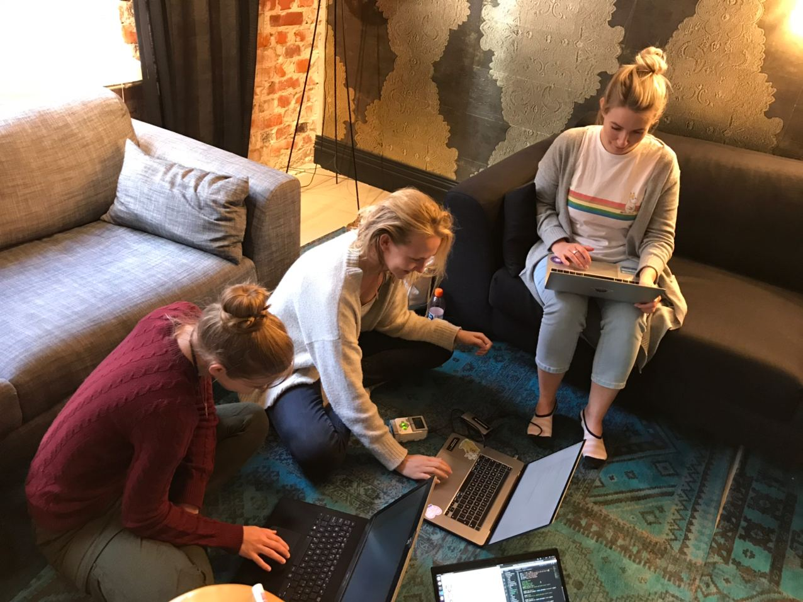
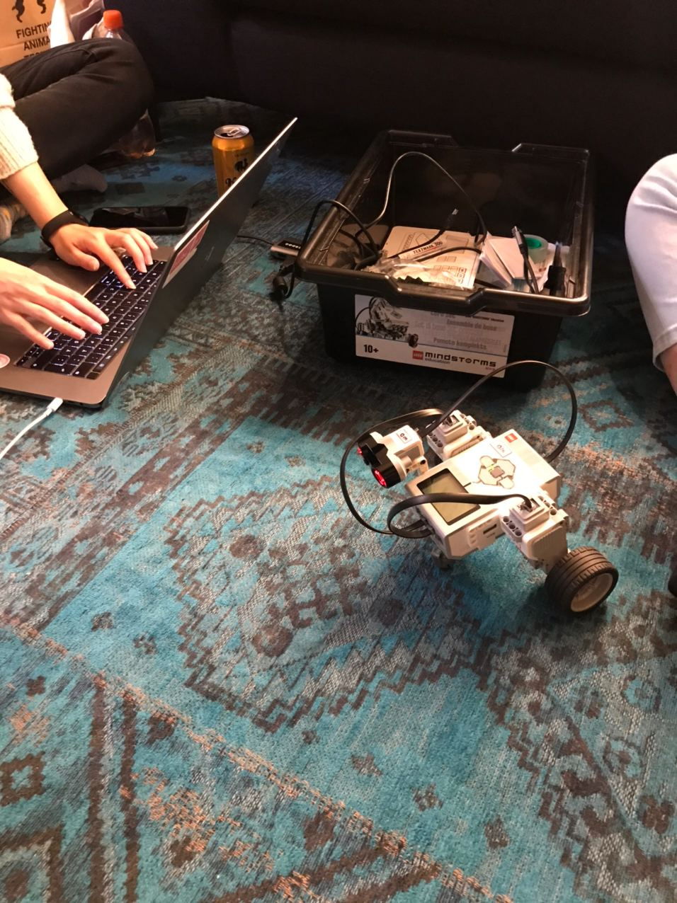

Our Robotics guild met up again on a sunny autumn day, this time in Helsinki. 
We spent the afternoon figuring out how to make our Lego robot speak and make sounds. We tried different ways of making the robot produce various tones, beeps, song lyrics and even Monty Python sayings! 

Just like last time we used the EV3 Python library to control the robot. 

