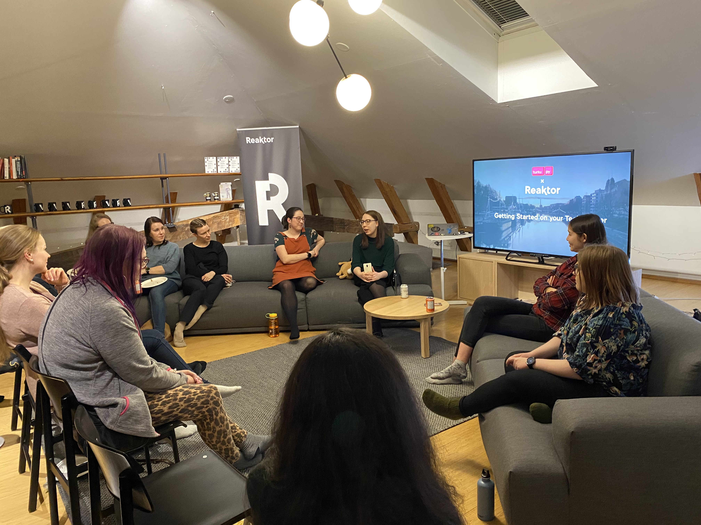

Helmikuussa meillä oli erittäin jännittävä paneelikeskustelu, johon osallistui kolme ohjelmistokehittäjää, joilla kaikilla on hyvin erilaiset urapolut. Tätä tapaamista isännöi Reaktor, ja muutamat reaktorilaiset jakoivat mukavia kesätyötarinoitaan.

Meillä oli myös pieni esittelykierros ja pizzaa!

