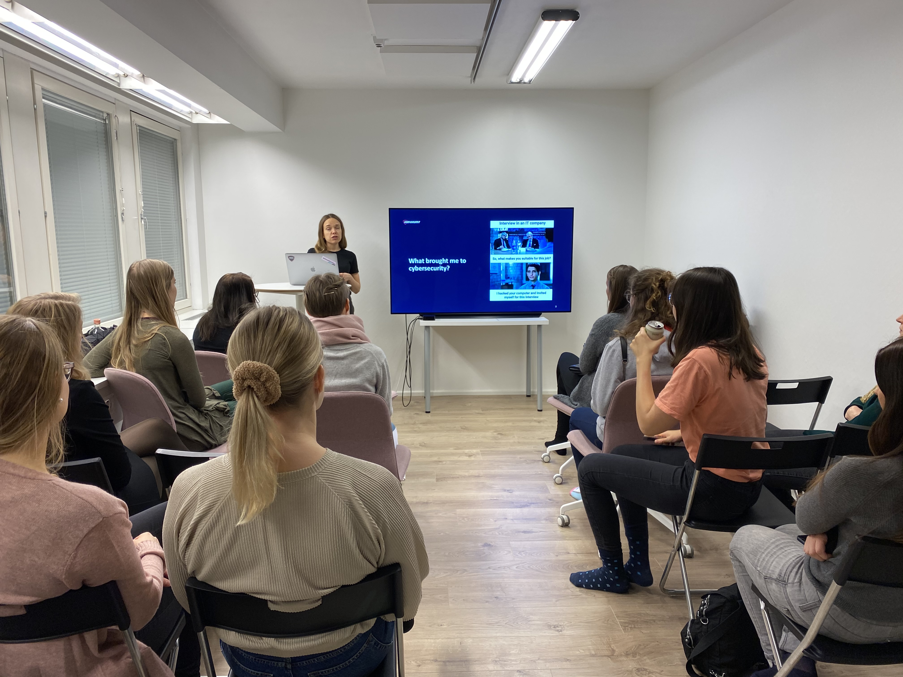

Tammikuussa kokoonnuimme Idention tiloihin puhumaan Instagramista ja kyberturvallisuudesta.

Heta Pärssinen työskentelee fullstack -kehittäjänä Duunitorilla. Hän on harrastuksekseen rakentanut Instagram botteja, ja halusi jakaa miitissämme niiden teknisiä salaisuuksia.

Pauliina Solanne työskentelee ohjelmistokehittäjänä HoxHuntilla. Kyberturvallisuus on yksi hänen mielenkiinnonkohteistaan, ja hänellä oli jaettavanaan kiinnostavaa tietoa sosiaalisesta manipuloinnista ja siitä, miten inhimillisyyttämme voidaan käyttää meitä vastaan.

