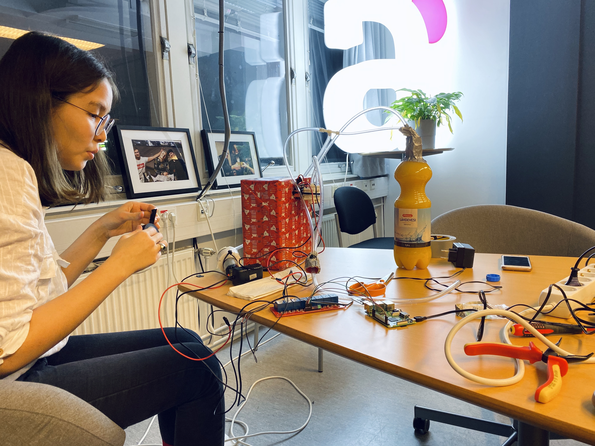
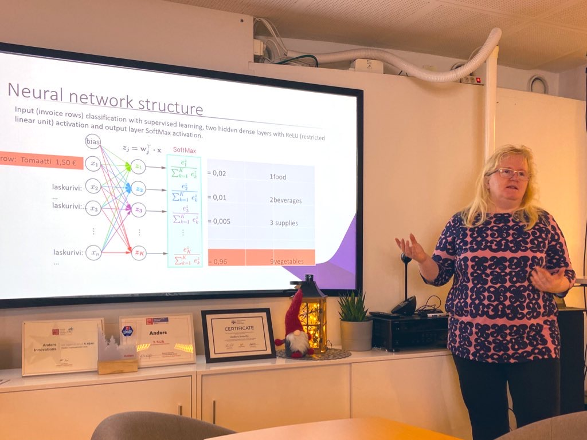

Joulukuun pikkujouluteemainen tapaamisemme pidettiin Andersin toimistolla Turussa.

Mila esitteli hänen Mimosa-kone-projektinsa, joka käyttää z-aaltoista kaukosäädintä ja python-ohjelmointikieltä drinkkijuomien sekoittamiseen.

Matemaatikko Eeva Rauramo piti esityksen tekoälyn käyttämisestä laskentatoimessa ja mitä neuroverkot oikeastaan ovat konepellin alla.

