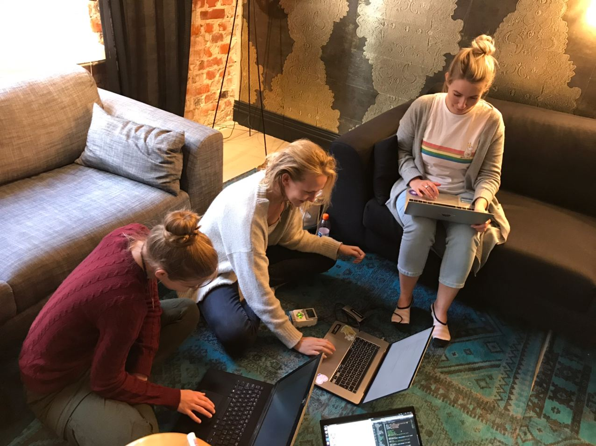
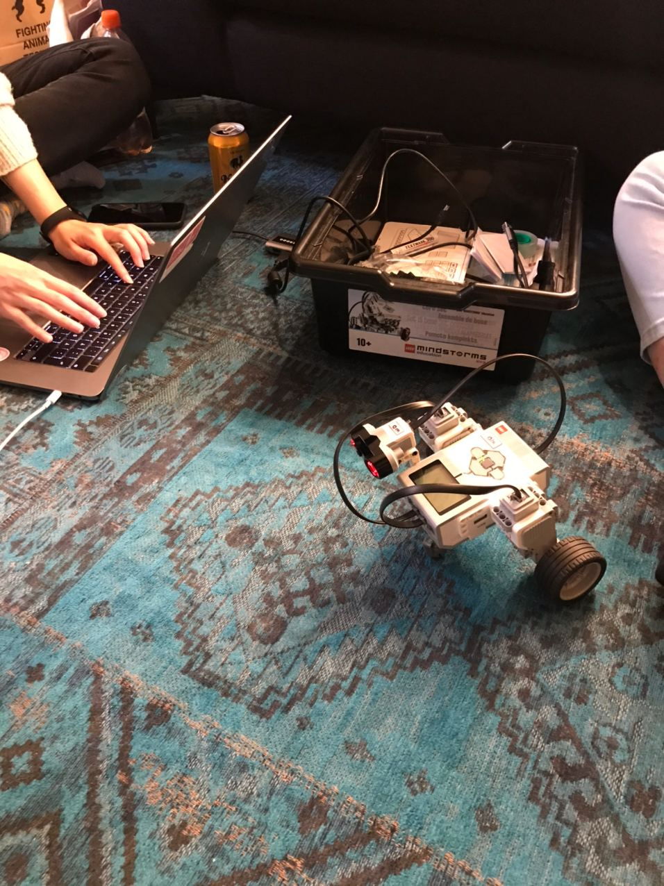

Robotiikka kerhomme tapasi jälleen aurinkoisena syyspäivänä, tällä kertaa Helsingissä.

Vietimme iltapäivän tutkien Lego robotin tapaa puhua ja tuottaa ääntä. Kokeilimme erilaisia äänenvärejä, piippauksia, laulujen lyriikoita ja jopa Monty Python sanontoja!

Käytimme tälläkin kerralla EV3 Python -kirjastoa robotin ohjaamiseen. 

