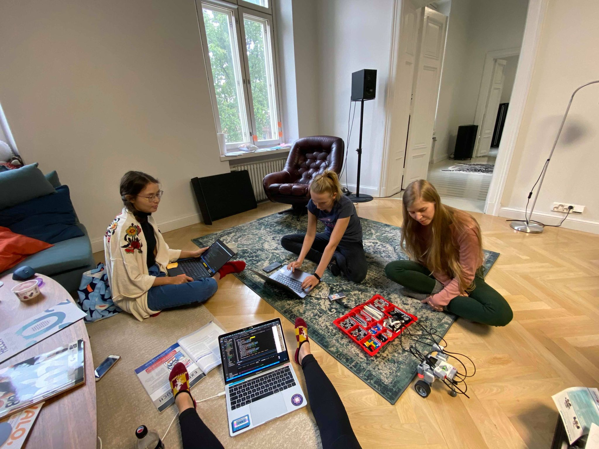

Vietimme sunnuntai-iltapäivän hypistelemällä uutta Lego Mindstorms-robottia. Käytimme VSCoden Live Share-toiminnallisuutta, jolla jaoimme saman koodin eri läppäreille samanaikaisesti, mikä oli hauskaa. Leikimme moottoreilla, sensoreilla ja äänillä käyttäen Python ev3dev-moduulia.

