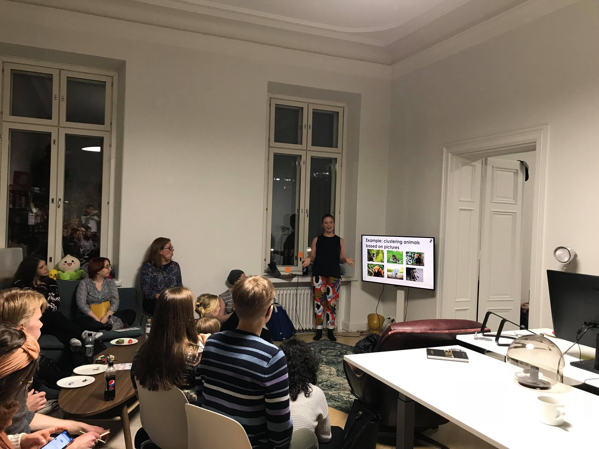

Lokakuun 2019 tapaaminen oli Turku.py:n ensimmäinen tapaaminen. Tapaaminen pidettiin Valohain toimistolla. Joanna esitteli Valohain toimintaa.

Puhujamme Anniina ja Jenna kertoivat klusteroinnista ja luonnollisen kielen käsittelystä liittyen tunteiden analysointiin Twitter-sisällöissä.

