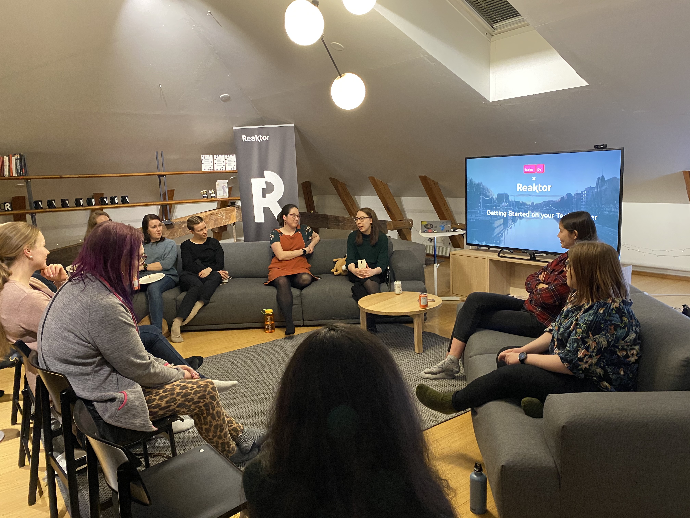

In February we had a very exciting panel discussion by three software developers who all had very different career paths. Our meetup was hosted by Reaktor, and some Reaktorians also shared some nice summer work stories.

We also had a get-to-know-each-other bingo and some pizza!

