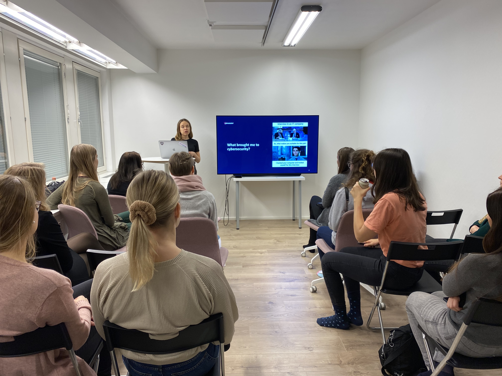

I januari besökte vi Identio för en träff om Instagram-bots och Cybersecurity.

Heta Pärssinen är en fullstack developer som jobbar på Duunitori. Att bygga Instabots för Instagram har varit ett sidoprojekt för henne och hon ville dela med sig några av de tekniska hemligheterna bakom det på den här träffen.

Pauliina Solanne är software developer på HoxHunt. Cybersecurity är ett av hennes intressen, och hon delade med sig några intressanta insikter inom social engineering och hur vår mänsklighet kan användas emot us.

