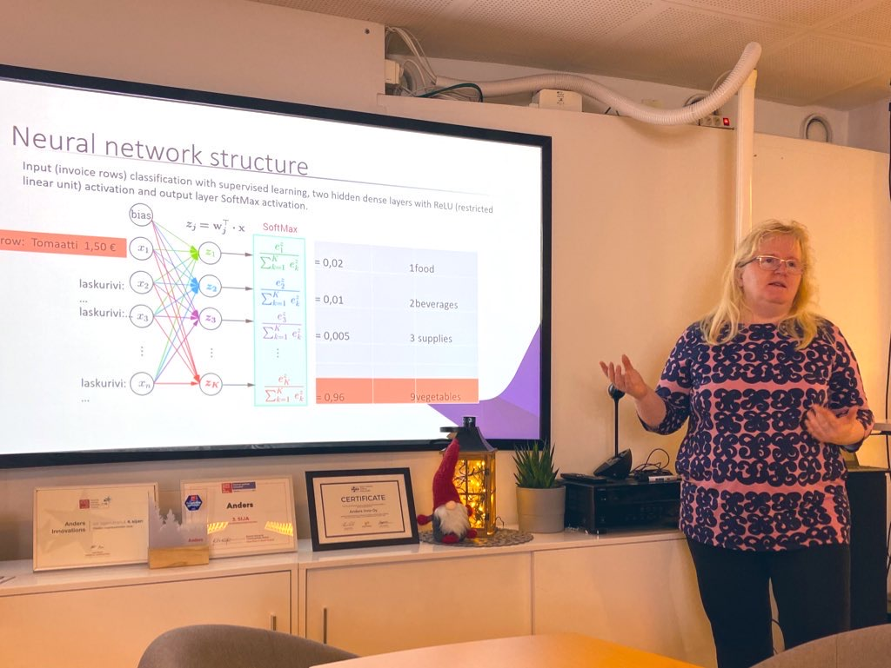

Vår December träff med ett "litet jul"-tema hölls av Anders och hans kontor i Åbo.

Mila presenterade hennes Mimosa maskinprojekt, som använder sig av en z-wave fjärrkontroll och python för att mixa drinkar.

Matematikern Eeva Rauramo höll en presenation om hur artificell intelligens kan användas inom bofköring och hur neurala nätwerk faktiskt fungerar under ytan.

