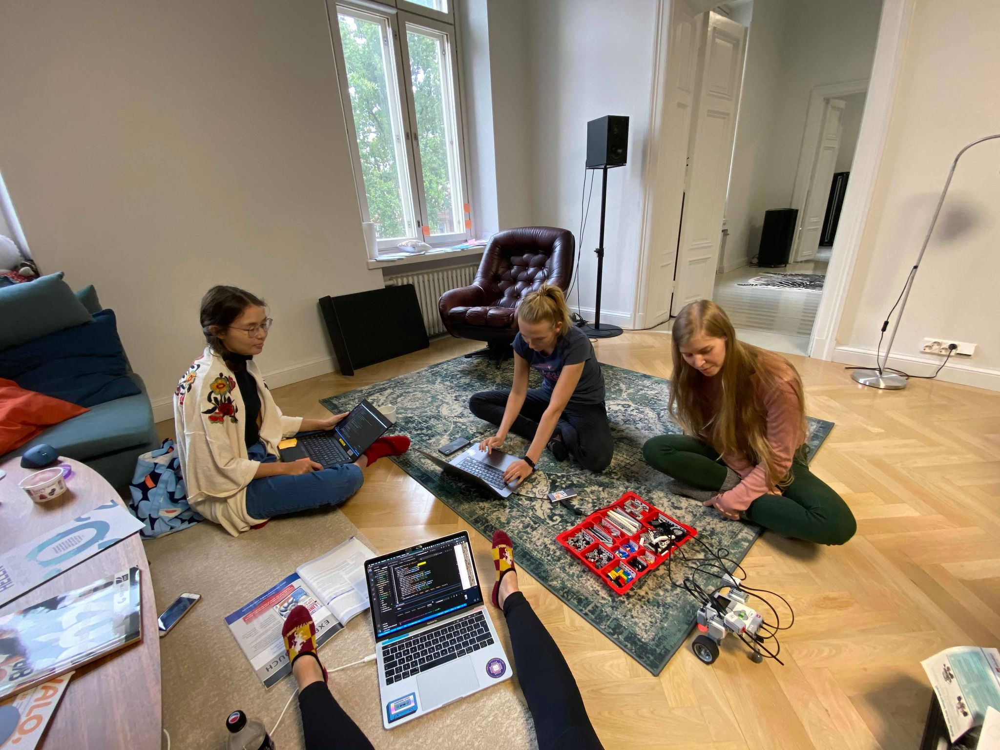

Vi spenderade Söndagseftermiddagen med att experimentera med Lego Mindstorms roboten. Vi använde VSCode Live Share-funktionen för att koda samtidigt från olika laptops vilket var väldigt kul. Vi lekte runt med motorerna, sensorerna och högtalarna genom att använda Python ev3dev-modulen.   

