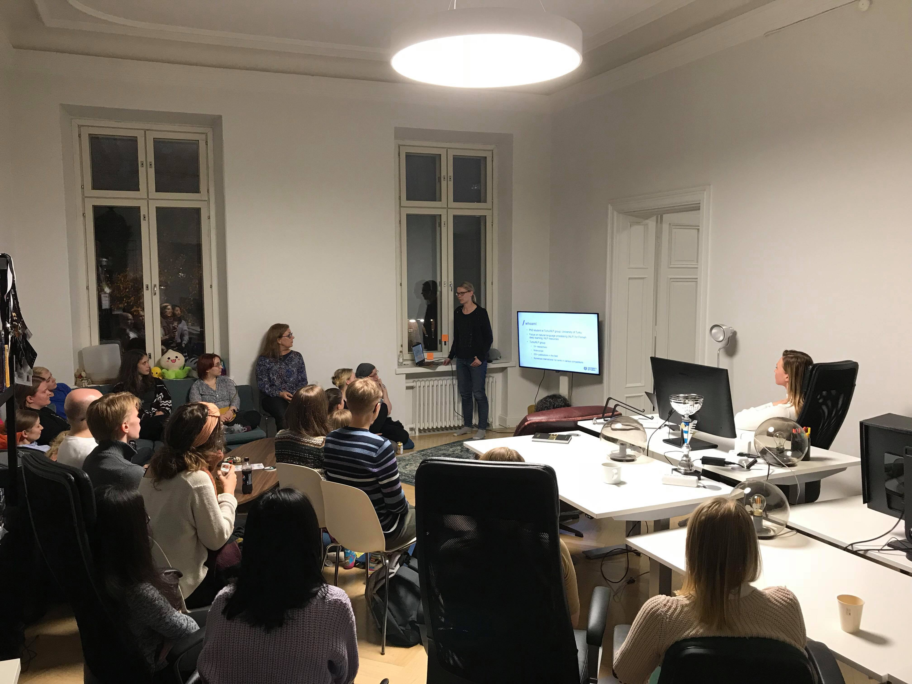
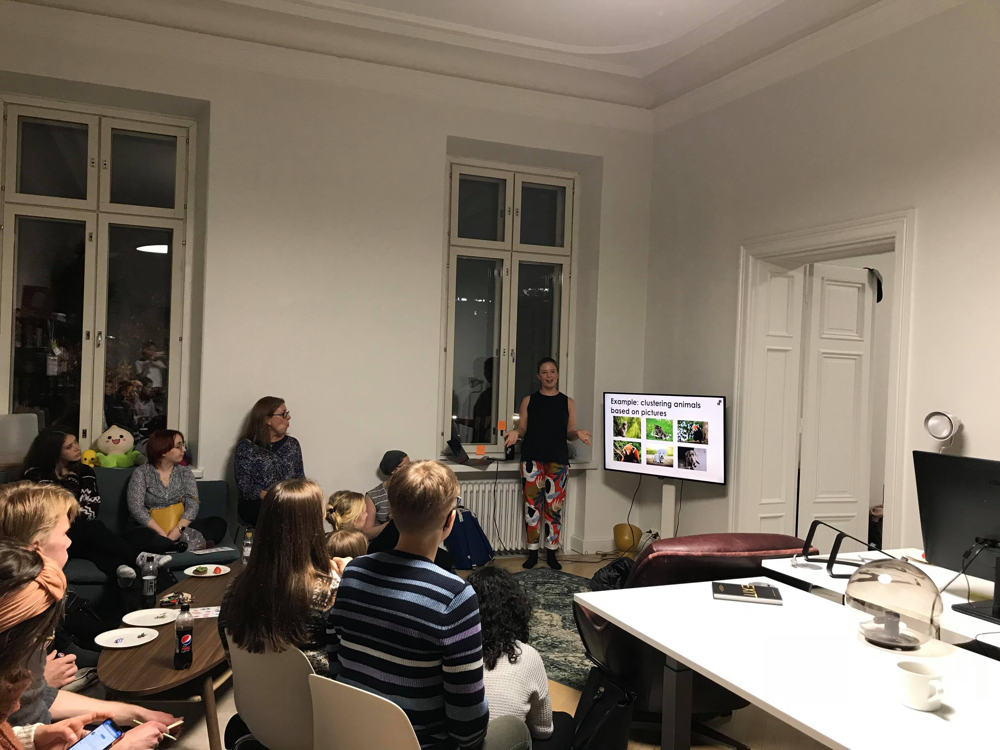

Vår Oktober 2019 träff var den första Turku.py träffen. Den hölls av Valohai. Vi hade en demonstration av hur Valohai jobbar av Joanna.

Våra talare Anniina och Jenna höll presentationer om "clustering" och "natural language processing" och hur man kan analysera känslor i Twitter flödet.

