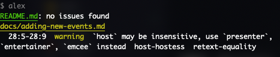

# Adding a new event

When you are adding a new event, here's the procedure: 

1. Create a folder with the name of the event (see other events as example) under the en-folder
2. Create a markdown file index.md under the folder
3. Add following remark to the start of the file, and fill it (again, check examples from other events):

```markdown
---

title: 
date: 
speakers:
  - 
host: 
type: "event"
lang: en

---
```

Some notes:

- **title** is a string
- **date** in "YYYY-MM-DD"-format
- **speakers** as a list
- **host** is a string
- **lang** is either en, fi or sv

At least title, date, type and lang are required.

4. Copy that file under fi- and sv-folders too. 
5. Change lang-codes from the files under fi and sv-folders to respective langcodes. 

Note, that first and foremost the event should be created in English. If you want, you can add Finnish and Swedish as well, but if you don't, please add an issue that these translations are missing, and leave the event text in English to the language folders. There is an issue template for adding missing translations.

The title of the issue should be `[Translations] title-of-the-event - langcode` so for example `[Translations] Robotics sunday - sv`. In the description of the issue, please provide a link to the index.md file under that language folder from which you are creating the ticket.


## About language

We use [alex.js](https://alexjs.com/) for linting insensitive language. The script is done, when committing, and if it finds something to point out, you have two options: 

### 1. Fix the wording

Alex gives out some suggestions, for example:



<div id="alex-example-text">
Text in the image reads: 
<pre>
<code>$ alex
README.md: no issues found
docs/adding-new-events.md 
  28:5-28:9 warning `host` may be insensitive, use `presenter`, `entertainer`, `emcee` instead  host-hostess retext-equality</code>
</pre>
</div>

### 2. Ignore the word

<!--alex ignore dad-mom-->
There are cases, the word is not actually used in a problematic way (for example, word "pop" can be problematic, if used as a word for dad (depending on the context), but as, for example, a array function it is totally ok). In these cases we can ignore the instance with `alex ignore` by passing a comment with following syntax:

```markdown
<!-- alex ignore rulename -->
```

so with the "pop"-example the ignore would be:

```markdown
<!-- alex ignore dad-mom -->
```

But where you can find the rulename? It is actually displayed in the command line message. In the example command line prompt above, the rulename is `host-hostess`, and it is always added after suggestions. (`retext-equality` points to the set of rules alex is using internally)

